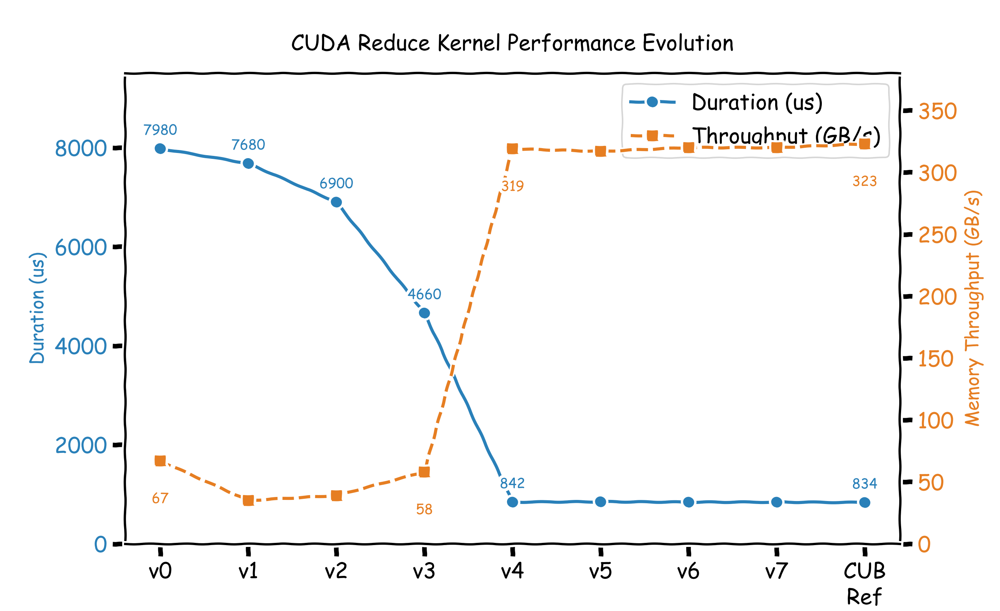
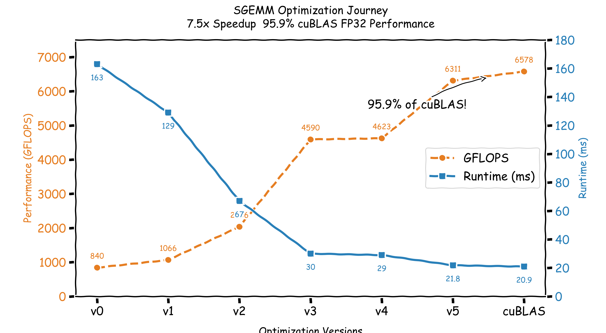
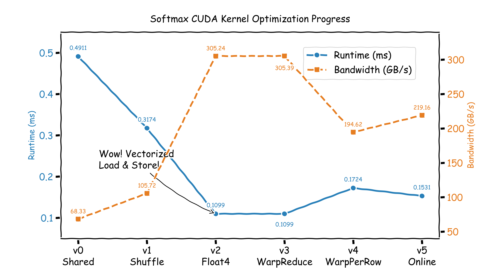

## Reduce
  
Read me in [READ_REDUCE](https://github.com/guangong789/CUDA_Learn/blob/main/reduce/READ_REDUCE.md)  
## Sgemm
  
Read me in [READ_SGEMM](https://github.com/guangong789/CUDA_Learn/blob/main/sgemm/READ_SGEMM.md)  
## Softmax  
  
Read me in [READ_SOFTMAX](https://github.com/guangong789/CUDA_Learn/blob/main/softmax/READ_SOFTMAX.md)
## Flash Attention
FP32 fused forward with online softmax, causal mask, CPU reference and benchmark.
Read me in [READ_FLASH_ATTENTION](flash_attention/READ_FLASH_ATTENTION.md)
