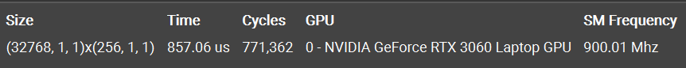
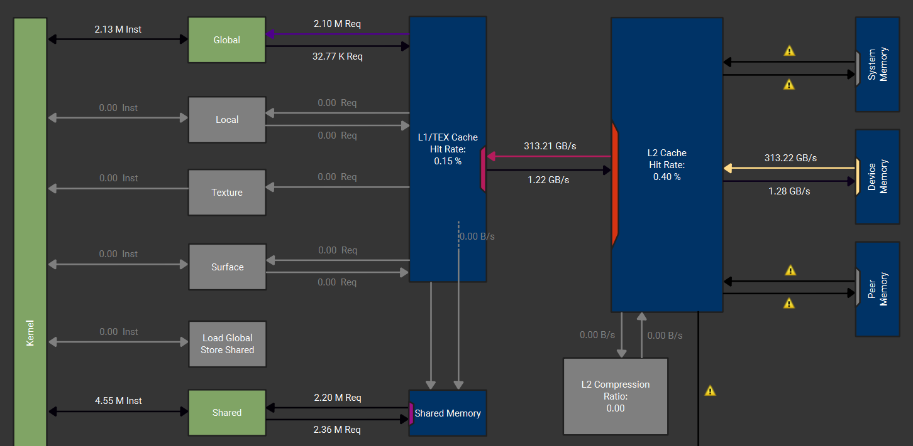

# Version Reference: CUB

## SOL

SOL 显示 Memory Throughput 达到了设备最大带宽的 96%
## Memory Analysis

memory analysis 显示 Memory Throughput 为 314.5 GB/s，达到了设备最大带宽的 94% 左右，有效吞吐很高，大部分带宽都传输了真正的计算数据
## Summary
L1TEX Global Store Access Pattern：The memory access pattern for global stores to L1TEX might not be optimal. On average, only 4.0 of the 32 bytes transmitted per sector are utilized by each thread. This could possibly be caused by a stride between threads.

NCU 提示全局内存写回中，平均 32 bytes 的 sector 只用到了其中 4 bytes。在全局内存写回时，是以 block 为单位的，跨 block 的线程无法自发合并，但是由于写回数据量相比输入数据量小了 3 个数量级，影响很小。
# VERSION 0: Naive Global Memory

## SOL

SOL 显示 Memory Throughput 为设备最大带宽的 37%
## Memory Analysis

memory analysis 显示 Memory Throughput 为 67.3 GB/s，为设备最大带宽的 20% 左右，只占 SOL Mem Throughput 的 54%，说明有相当一部分带宽传输的是非合并访存的废数据，整体有效吞吐很低
## Summary
Uncoalesced Global Accesses：This kernel has uncoalesced global accesses resulting in a total of 56623104 excessive sectors (56% of the total 100401152 sectors). Check the L2 Theoretical Sectors Global Excessive table for the primary source locations. 

NCU 提示由于非合并内存访问，传输数据中有 56% 的扇区是冗余的，导致了 memory analysis 中实际有效吞吐很低，这是影响性能的主要原因
# VERSION 1: Shared Memory

目前的计算是一个数据对应一个线程，一个 block 有 256 个线程/数据。按照惯例使用高速的 shared memory 来存每个 block 负责的数据，但是发现性能提升只有 3.77%
## SOL

查看 SOL，使用共享内存后 Memory Throughput 相对上个版本有 50% 的提升，L2 cache 暴跌 81%，因为将更多的访存请求拦截在了共享内存层级，同时可以看出：由于数据量较小，上一个版本能够将这些数据缓存在 Cache 中，导致性能提升并不明显
## Memory Analysis


有效显存带宽下降 47.7%，通过共享内存使用更少显存带宽完成了相同的计算。Hit Rate 暴跌，绝大多数访存在共享内存中完成。Mem Pipes Busy 增加 50%，此时的负载重心转移到片上共享内存。
## Summary
L1TEX Global Store Access Pattern

该版本的有效带宽利用率相比上一版的 54%，再次下降到了 18%，主要是因为此时主循环高频访存在片上共享内存中完成，导致其他矛盾被放大
# VERSION 2：Branch Divergence

在上一版中
```cpp
for (int i = 1; i < blockDim.x; i <<= 1) {
    if (tx % (2 * i) == 0) shared[tx] += shared[tx + i];
    __syncthreads();
}
```
在 `blockDim.x = 256` 的情况下，第一轮循环 `i = 1` 时，warp 中只有偶数线程在执行，`i = 16` 时，`tx % 32 == 0`，一个 warp 中只有第一个线程执行，多数线程在空转，造成了严重的线程束分化
```cpp
if (tx < blockDim.x / (2 * i)) {
    int source = tx * 2 * i;
    shared[source] += shared[source + i];
}
```
通过修改分支条件，在 `i = 1` 时，活跃的线程集中在 $tx \in [0,128)$ 的部分，这是 4 个完整的 warp，避免了同一线程束中有空转的线程
## Memory Analysis


Mem Busy 提升 59%，消除了分化的 Warp 实现了整齐的指令发射，原本零散的访存请求在时间轴上能够被很好的压缩
## Summary
Uncoalesced Shared Accesses：This kernel has uncoalesced shared accesses resulting in a total of 27525120 excessive wavefronts (70% of the total 39321600 wavefronts).

NCU 提示当前代码存在非合并的共享访问，共享内存中有严重的 bank conflict，70% 的 wavefronts 是冗余的
# VERSION 3：Bank Conflict