# `constexpr int N = 67108864;`
# Version Reference: CUB
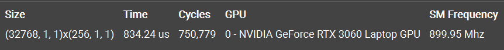
## SOL
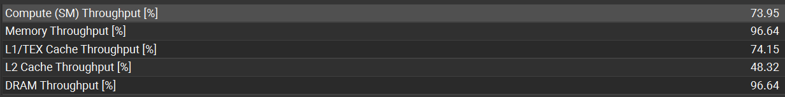  
SOL 显示 Memory Throughput 达到了设备最大带宽的 96%
## Memory Analysis
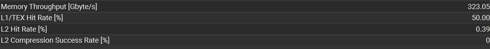
memory analysis 显示 Mem Throughput 为 323 GB/s，达到了设备最大带宽的 96% 左右，有效吞吐很高，绝大部分带宽都传输了真正的计算数据
## Summary
L1TEX Global Store Access Pattern：The memory access pattern for global stores to L1TEX might not be optimal. On average, only 4.0 of the 32 bytes transmitted per sector are utilized by each thread. This could possibly be caused by a stride between threads.

NCU 提示全局内存写回中，平均 32 bytes 的 sector 只用到了其中 4 bytes。在全局内存写回时，是以 block 为单位的，跨 block 的线程无法自发合并，但是由于写回数据量相比输入数据量小了 3 个数量级，影响很小。
# VERSION 0: Naive Global Memory
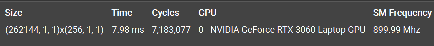  
## SOL
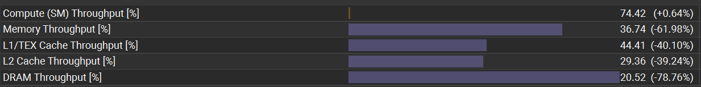  
SOL 显示 Memory Throughput 为设备最大带宽的 37%
## Memory Analysis
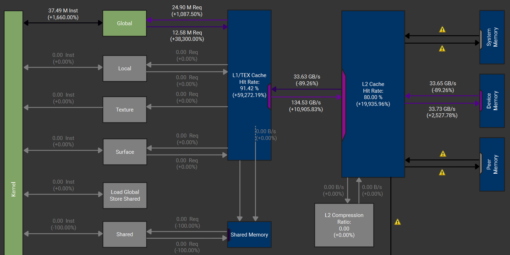  
memory analysis 显示 Memory Throughput 为 67.3 GB/s，为设备最大带宽的 20% 左右，只占 SOL Mem Throughput 的 54%，说明有相当一部分带宽传输的是非合并访存的废数据，整体有效吞吐很低
## Summary
Uncoalesced Global Accesses：This kernel has uncoalesced global accesses resulting in a total of 56623104 excessive sectors (56% of the total 100401152 sectors). Check the L2 Theoretical Sectors Global Excessive table for the primary source locations.

NCU 提示由于非合并内存访问，传输数据中有 56% 的扇区是冗余的，导致了 memory analysis 中实际有效吞吐很低，这是影响性能的主要原因
# VERSION 1: Shared Memory
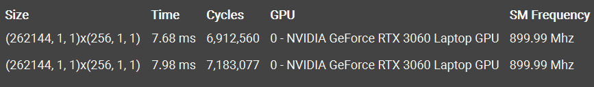  
目前的计算是一个数据对应一个线程，一个 block 有 256 个线程/数据。按照惯例使用高速的 shared memory 来存每个 block 负责的数据，但是发现性能提升只有 3.77%
## SOL
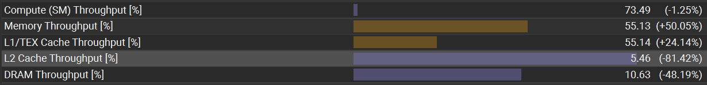  
查看 SOL，使用共享内存后 Memory Throughput 相对上个版本有 50% 的提升，L2 cache 暴跌 81%，因为将更多的访存请求拦截在了共享内存层级，同时可以看出：由于数据量较小，上一个版本能够将这些数据缓存在 Cache 中，导致性能提升并不明显
## Memory Analysis
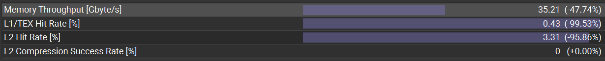  
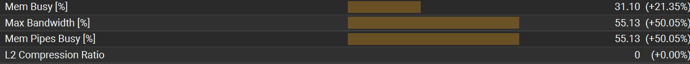  
有效显存带宽下降 47.7%，通过共享内存使用更少显存带宽完成了相同的计算。Hit Rate 暴跌，绝大多数访存在共享内存中完成。Mem Pipes Busy 增加 50%，此时的负载重心转移到片上共享内存。
## Summary
L1TEX Global Store Access Pattern

该版本的有效带宽利用率相比上一版的 54%，再次下降到了 18%，主要是因为此时主循环高频访存在片上共享内存中完成，导致其他矛盾被放大
# VERSION 2：Branch Divergence
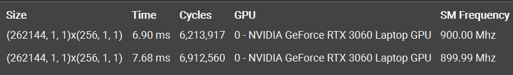  
在上一版中
```cpp
for (int i = 1; i < blockDim.x; i <<= 1) {
    if (tx % (2 * i) == 0) shared[tx] += shared[tx + i];
    __syncthreads();
}
```
在 `blockDim.x = 256` 的情况下，第一轮循环 `i = 1` 时，warp 中只有偶数线程在执行，`i = 16` 时，`tx % 32 == 0`，一个 warp 中只有第一个线程执行，多数线程在空转，造成了严重的线程束分化
```cpp
if (tx < blockDim.x / (2 * i)) {
    int source = tx * 2 * i;
    shared[source] += shared[source + i];
}
```
通过修改分支条件，在 `i = 1` 时，活跃的线程集中在 $tx \in [0,128)$ 的部分，这是 4 个完整的 warp，避免了同一线程束中有空转的线程
## Memory Analysis
  
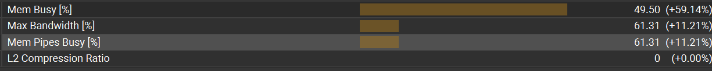  
Mem Busy 提升 59%，消除了分化的 Warp 实现了整齐的指令发射，原本零散的访存请求在时间轴上能够被很好的压缩
## Summary
Uncoalesced Shared Accesses：This kernel has uncoalesced shared accesses resulting in a total of 27525120 excessive wavefronts (70% of the total 39321600 wavefronts).

NCU 提示当前代码存在非合并的共享访问，共享内存中有严重的 bank conflict，70% 的 wavefronts 是冗余的
# VERSION 3：Bank Conflict
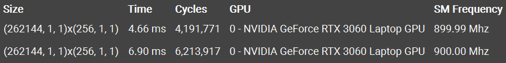  
```cpp
for (int i = 1; i < blockDim.x; i <<= 1) {
    if (tx < blockDim.x / (2 * i)) {
        int source = tx * 2 * i;
        shared[source] += shared[source + i];
    }
     __syncthreads();
}
```
上一版解决了线程束分化后，性能获得了 10% 左右的提升，但是循环在 `i = 16` 时：  
| tx | source | bank | source+i | bank |
|:--:|:------:|:----:|:--------:|:----:|
| 0 | 0 | 0 % 32 = 0 | 16 | 16 % 32 = 16 |
| 1 | 32 | 32 % 32 = 0 | 48 | 48 % 32 = 16 |
| 2 | 64 | 64 % 32 = 0 | 80 | 80 % 32 = 16 |
| ...| ... | ... | ... | ... |

发现所有 8 个活跃的线程都在访问共享内存中的 bank0 和 bank16，在 `i = 16` 之后的循环中也是类似情况，存在严重的 bank conflict，导致硬件的串行化调度。上一版代码中连续的线程访存的是跳跃的地址，通过将连续线程的访存地址也改成连续的，可以改善这种情况：  
```cpp
for (int i = blockDim.x / 2; i > 0; i >>= 1) {
    if (tx < i) shared[tx] += shared[tx + i];
    __syncthreads();
}
```
考虑 `i = 16` 时：
| tx | address1 | bank | address2 | bank |
|:--:|:------:|:----:|:--------:|:----:|
| 0 | 0 | 0 % 32 = 0 | 16 | 16 % 32 = 16 |
| 1 | 1 | 1 % 32 = 1 | 17 | 17 % 32 = 17 |
| 2 | 2 | 2 % 32 = 2 | 18 | 18 % 32 = 18 |
| ...| ... | ... | ... | ... |

此时活跃的线程依然集中，但是相邻线程访问的 bank 都是不同的
## Memory Analysis
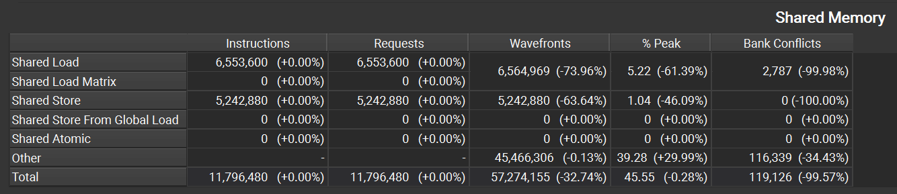  
在 mem analysis 中可以发现，通过改变访存地址减少了 33% 的冗余波前，其中 Load 中的冗余减少了 74%，基本消除了 bank conflict，也为代码带来了 32% 的性能提升
## Summary
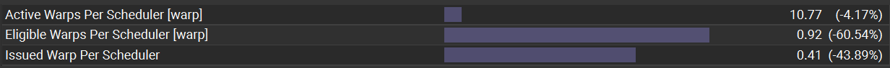  
  
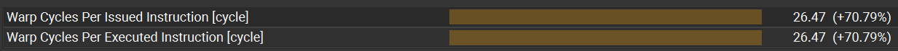  
观察该版本的线程调度情况可以发现，平均 26 个 cycles才能发射执行一个warp，等待时间增加了 70%，scheduler No Eligible 上升 115%，调度器有 60% 的时间都在空转！  
造成这种情况的原因大概是因为在上一个版本中，由于 bank conflict 导致指令执行串行化，使得每个时钟周期都有亟需处理的工作负载，当冲突归零后，shared memory 操作能够在更少周期内完成，但是这也导致了硬件的latency hiding 能力大幅降低  
接下来考虑采用 `float4` 向量化加载，让每个线程一次性读取 8 个连续元素，在寄存器中完成局部累加后再进入 shared memory。这样不仅能够减少 load instruction 数量，还能提高单线程计算强度，为 scheduler 提供更多可隐藏 latency 的工作负载。  
# VERSION 4：FLOAT4 Vectorized
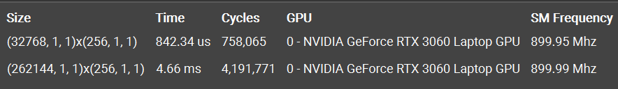  
在改变加载方式，使用一个线程处理 2 个 `float4` 之后，性能大幅提升 5 倍以上，这也验证了 reduce 是一个 memory bound 的算子。  
## SOL
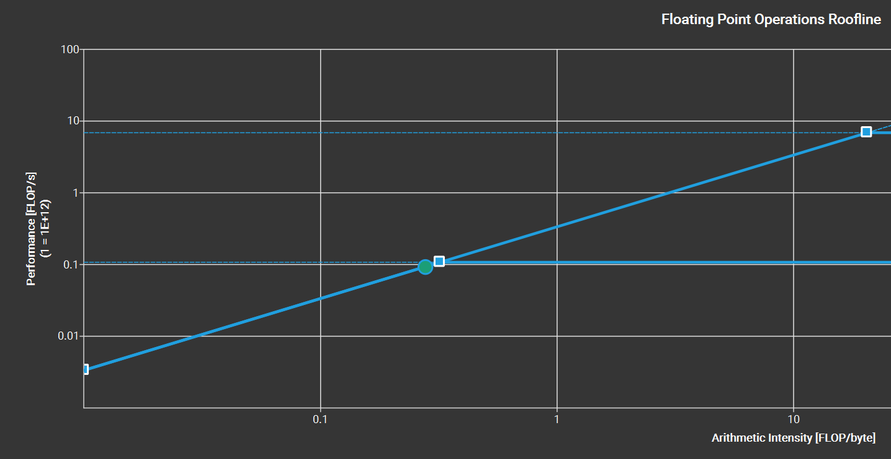  
查看此时的 Roofline 图，当前版本已经接近单精度 FLOPs 的极限
## Memory Analysis
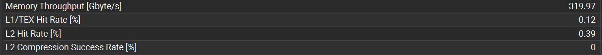  
在 memory analysis 中可以看到当前的 mem throughput 为 320 GB/s，已经达到了当前硬件最大带宽的 95%
## Summary
Thread Divergence：Instructions are executed in warps, which are groups of 32 threads. Optimal instruction throughput is achieved if all 32 threads of a warp execute the same instruction. The chosen launch configuration, early thread completion, and divergent flow control can significantly lower the number of active threads in a warp per cycle. This kernel achieves an average of 31.9 threads being active per cycle. This is further reduced to 19.3 threads per warp due to predication. The compiler may use predication to avoid an actual branch. Instead, all instructions are scheduled, but a per-thread condition code or predicate controls which threads execute the instructions. Try to avoid different execution paths within a warp when possible.

在 summary 中，NCU 依然提示存在线程分化的情况，这是由于规约进行到后期，活跃线程数量少于 32 个时，此时一个线程束里面不可避免的会出现分歧，于是选择手动对最后一个 warp 的线程进行规约，还能够去掉循环最后五轮的 `__syncthreads();` 物理屏障同步
# VERSION 5：Unroll Last Warp
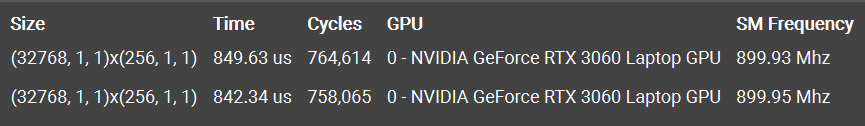  
手动展开最后一个 warp 后，性能并没有什么提升，这是因为相对与最后的 global store 阶段的非合并写入，last warp 对性能的影响较小，而且由于使用了 `volatile` 关键字，这强制管线每一次加法都必须真实走一遍 shared memory 硬件，无法利用极速的寄存器进行局部暂存，
## Summary
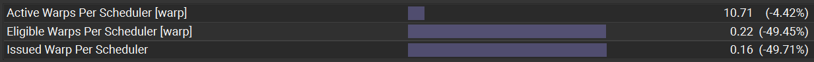  
  
值得关注的是，在 unroll last warp 后，调度器的指标再次腰斩，No Eligible 涨到 84%，这可能是因为在去掉最后 5 次物理同步过后，原本在 Barrier 状态挂起的指令不再需要等待同步，此时调度器大部分空转都是指令处理完毕造成的
# VERSION 6：Complete Unroll
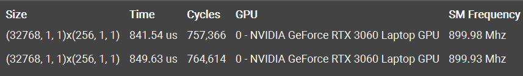  
可以发现，由于之前版本使用了 `#pragma unroll` 指令，所以手动展开循环带来的收益微小
## Summary
Long Scoreboard Stalls：On average, each warp of this kernel spends 66.9 cycles being stalled waiting for a scoreboard dependency on a L1TEX (local, global, surface, texture) operation. Find the instruction producing the data being waited upon to identify the culprit. To reduce the number of cycles waiting on L1TEX data accesses verify the memory access patterns are optimal for the target architecture, attempt to increase cache hit rates by increasing data locality (coalescing), or by changing the cache configuration. Consider moving frequently used data to shared memory. This stall type represents about 83.0% of the total average of 80.7 cycles between issuing two instructions.  

在循环完全展开后：两条指令发射间距拉长至 80.7 cycles，其中 83.0% 的时间属于 `Long Scoreboard Stall`
# VERSION 7：SHUFFLE
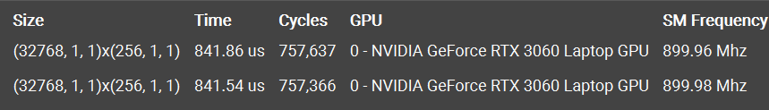  
Shuffle 的物理本质——片上通信的局部优化：  
`__shfl_down_sync` 的核心优势在于跳过了 Shared Memory 的存储管线，直接在 SM 内部的高速寄存器网络中完成数据交换，但是由于 Reduce 本质是 Memory Bound 的算子，其主要瓶颈还是在于 global 的访存而非片上访存，所以使用 `shuffle` 后代码性能基本与上一版本持平
# END
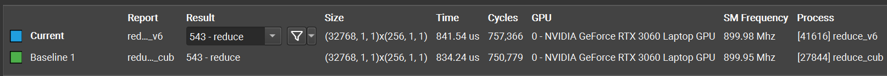  
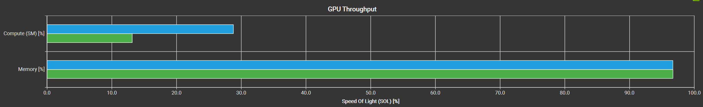
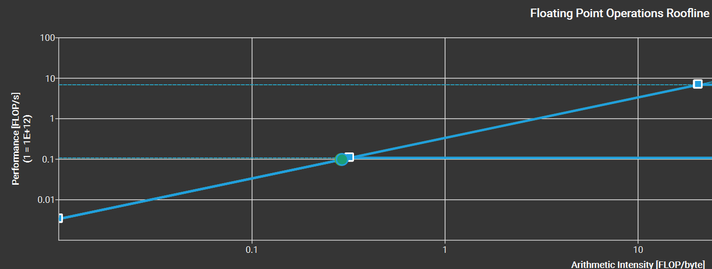  
通过最优版本与 CUB reference 的对比可以发现在该设备上，reduce 的性能已经逼近官方代码，并且通过 Roolfine 图可以看出，二者均已达到带宽极限