```
在写 readme 的过程中发现自 version 3 开始，测试程序在连续运行时出现了性能分级跳变：sgemm_v3 耗时在 29ms (4700 GFLOPS) 与 51ms (2700 GFLOPS) 两个固定档位横跳。对照组 cuBLAS 亦受到波及，后期算力从 6400 GFLOPS 跌至 5000 GFLOPS。
猜测可能是因为 WSL2 环境下的硬件功耗与温度导致，所以从 version 3 及以后的性能对比，开始采用多次 benchmark 中的性能峰值进行比较。
这可能会导致文中 benchmark 与 ncu profiling 的数据不能自洽，但是 ncu 关注的是硬件微观层面的比例与瓶颈，而 benchmark 关注宏观层面的性能极限，所以二者核心结论并不冲突。
```
# `constexpr int M{4096}, K{4096}, N{4096};`
# VERSION REFERENCE: CUBLAS  
  
## SOL
  
# VERSION 0: Global Memory  
  
仅用 Global Mem 的版本用时为 cublas 的 10 倍
## Overview  
  
## SOL  
  
查看 NCU Sol 的数据发现，SM Throughput， Memory Throughput 以及 L1 Cache 全部接近 100%，但 L2 Cache 和 DRAM Throughput 却仅有 8%，这可能是因为程序频繁的 global load 请求已经将 L1 堵满了，指令大多 stall 在 L1，向 L2 和 DRAM 发射请求的效率很低  
## Memory WorkLoad Analysis  
  
  
在 `{4096, 4096, 4096}` 的测试规模下，由于每个线程只处理一个点，`value += A(row, k) * B(k, col)` 最终会有 $4096\times4096\times2\times4096\div32=4294967296$ 条指令，在同一个 warp 中，线程都访问的是 A 的同一个 float，触发广播，只需要一个 sector；对于 B，warp 会访问 32 个不同的 float，而一个 sector 32 字节，8 个 float，这样一条指令需要请求 4 个 sector，$(1+4) \div 2=2.5$ (sector/request)，与 NCU 显示数据相符合，此时程序的总 sector 就为 $4294967296\times2.5=10737418240$，sector misses to L2 一共有 536870912，$536870912 \div 10737418240=0.05$，刚好对应 memory analysis 显示的 L1 Hit Rate = 95%  
## Scheduler Statistics  
  
  
平均每个调度器下挂载的活跃线程束达到了 8 个，但是 Eligible 的线程束却只有 1.15 个，能发射的更是只有 0.23 个，调度器 No Eligible 的时间占据 76%，这也对应了 SOL 中的状态，由于 global memory 的访存延迟太高了，导致绝大多数指令都只能 stall，程序处在一种“虚假繁荣”的状态  
## Summary
L1TEX Global Load Access Pattern：The memory access pattern for global loads from L1TEX might not be optimal. On average, only 26.4 of the 32 bytes transmitted per sector are utilized by each thread. This could possibly be caused by a stride between threads

NCU 显示 global load 并非最优，这是因为在 `A(row, k)` load 的时候，线程只需要一个 float 4字节，但是请求必须以 sector 32字节为单位，导致请求的数据没有完全利用。接下来考虑利用高速的片上共享内存来替代过多的全局内存访问，减小访存延迟，避免所有指令都通过 L1 Cache 向 global 请求数据。

  
naive SGEMM 性能只有 cublas 的 $\tfrac{1}{8}$，FLOPs 也仅达到 $\tfrac{1}{8}$
# VERSION 1: Shared Memory
  
使用 shared mem 后的 kernel 相比于 v0 有 20.7% latency reduction，1.26× speedup  
## Overview  
  
## SOL  
  
使用 shared mem 后的代码，各项指标发生了比较一致的变化
## Memory Workload Analysis  
  
  
L1 Hit Rate 归零，通过 shared mem 避免了高延迟的 global 访问，还能看到虽然 shared mem 没有 padding，但是也并没有发生 bank conflict，多出的 wavefront 可能是因为代码中设置的线程块太大以及访问共享内存时的分支判断造成的
## Scheduler Statistics  
  
  
在 shared mem 的程序中，Eligible warp 的数量下降了接近 $\tfrac{1}{5}$，调度器的效率进一步降低，有 79% 的时间都在空转，这是因为虽然用了高速的片上共享内存，但是也不得不使用 `__syncthreads()` 等待同步，增加了 stall 线程的数量  
## Summary
Mio Throttle Stalls: On average, each warp of this kernel spends 23.1 cycles being stalled waiting for the MIO (memory input/output) instruction queue to be not full. This stall reason is high in cases of extreme utilization of the MIO pipelines, which include special math instructions, dynamic branches, as well as shared memory instructions. When caused by shared memory accesses, trying to use fewer but wider loads can reduce pipeline pressure. This stall type represents about 61.1% of the total average of 37.9 cycles between issuing two instructions.

MIO 限流停顿：NCU 提示平均每个 warp 要花 23.1 个 cycle 等待 MIO 指令队列腾出空间，因为队列已经满了。在当前 $1\times1$ 的线程-数据映射下，每一次循环都要发出很多条 shared memory instructions，造成了 MIO pipeline 的拥堵  

  
即使用了 shared mem 避免了 global 的访存，代码性能仍然只有 cublas 的 $\tfrac{1}{6}$ 左右
# VERSION 2: $2\times2$ Blocking  
  
使用一个线程负责 2*2 数据的搬运和计算，成功获得了 51.4% latency reduction 和 2.06× 的 speedup  
## SOL  
  
改用单线程-多数据的映射后，各项 throughput 都获得了提升，其中由于指令数的减少，L2 以及 DRAM throughput 翻了一倍
## Memory Workload Analysis  
  
  
得益于线程数的减少，整个程序的同步开销也大幅降低，从而以更高的效率搬运数据，也带来了吞吐量的翻倍 
## Scheduler Statistics  
  
  
这下调度器效率有了很大的提升，平均每个调度器中就绪的线程束数量增加了 118%，活跃的线程束也多了 49%，调度器在 37% 的时间里都是有就绪线程束的，相比上个版本增加了 77%，但是也能看到，虽然 eligible warps per scheduler 达到了 2.08，但是每个调度器能够发射的线程束却只有 0.38 个，在 memory analysis 中能够发现此时 max bandwidth 和 mem pipelines busy 都已经接近 100% 了，导致大部分时间 eligible 的 warp 都不能发射出去
## Occupancy
  
由于上一个版本使用了 $32\times32=1024$ 线程的超大 block，导致硬件占有率偏低，缩减线程数之后，程序达到了 100% 的占有率，active warps per SM 也几乎是设备的最大值 48 个
## Summary
在代码中，虽然使用 2*2 block 减少了线程数量，但是一个线程要做四次 FMA，仍然需要 4 条 load 指令，此时片上访存指令与计算指令的比值是 1 : 1，这也是 mem pipeline busy 达到 97% 的原因，接下来可以考虑使用特殊的 `float4`，通过一条指令就能加载 4 个数，减小管线的繁忙程度

  
现在的代码，性能已经接近 cublas 的 $\tfrac{1}{3}$ 了
# VERSION 3: Register Tiling  
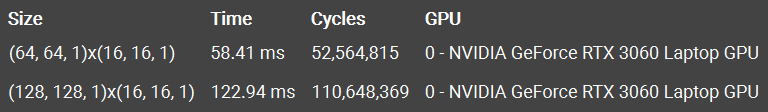  
使用 float4 来搬运数据后，代码获得了 52.8% Latency Reduction 和 2.12× Speedup
## Overview  
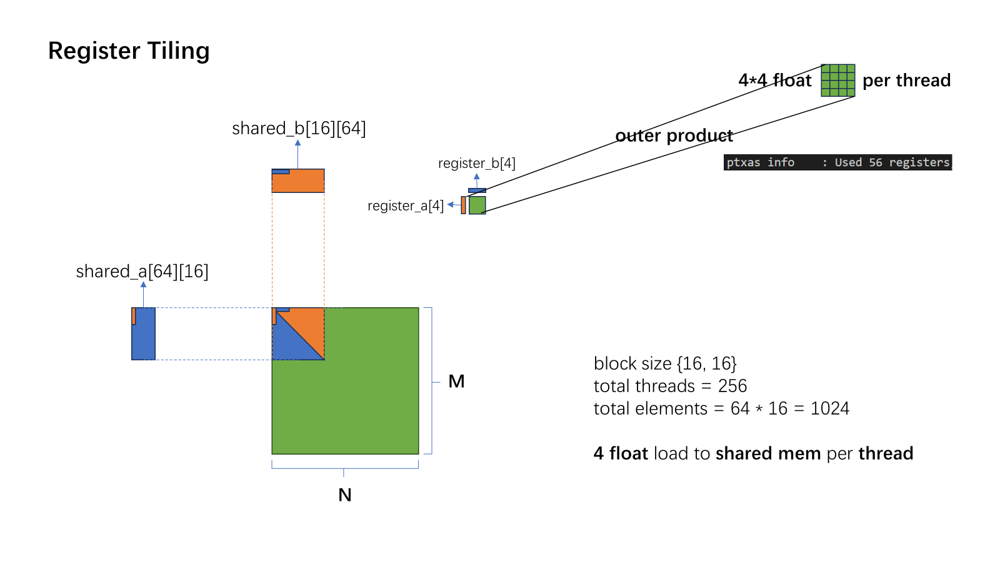  
## SOL  
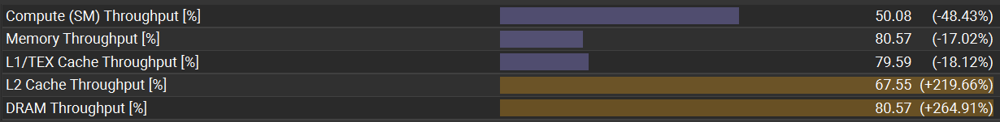  
sol 中 compute throughput 减少了接近一半，说明计算效率大大提高，由于使用了更大的寄存器分块，使 memory throughput 减小了 17%，而 float4 的使用，此时访存指令更加紧凑合并，使 L2 cache / DRAM throughput 均提升至上一版本的 3 倍以上
## Memory Workload Analysis  
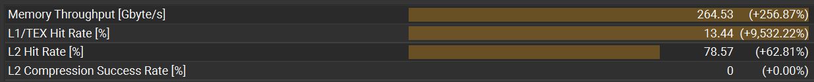  
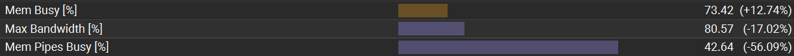  
该版本的 memory throughput 为 264.5 GB/s，相较上一版提升了 256%，此时已经达到了硬件带宽的 78%, 由于访存指令的优化, mem pipeline busy 减少了 56%, 极大缓解了管线的空转  

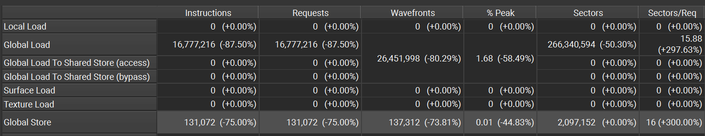  
由于使用 float4 写回, 现在 global store instructions 相较上一版逐个写回刚好减少了 $\tfrac{3}{4}$.在 v2 的代码中, blocks 总数为 $\tfrac{4096}{32}\times\tfrac{4096}{32}=16384$, tile_cnt = $4096 \div 32 = 128$, 总 shared mem 数量为 2048 个 float, 故最终 global load instructions 为 $16384\times2048\times128\div32=134,217,728$, v3 的总 load instructions 为 $\tfrac{4096}{64}\times\tfrac{4096}{64}\times\tfrac{2048}{4}\times\tfrac{4096}{16}\div32=	16,777,216$, 的确是降低了 87.5%
## Scheduler Statistics
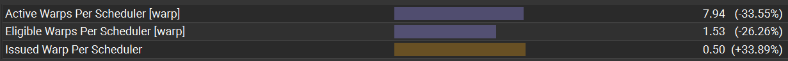  
  
调度器的数据有了很好的提升, 在 mem pipeline busy 从原本的 97% 降低到 42% 过后, 内存管线解决了拥堵状态, 现在平均发射的效率增加了 34%, 达到 0.5, 使排队的 warp 也更少了, 还能发现调度器的空转时间又减少 2 成, 现在 Eligible 的时间已经和空转时间持平
## Occupancy  
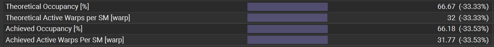  
在这一版中, 由于寄存器的使用数量从 40 增加到了 56, 导致占有率减少了 $\tfrac{1}{3}$, 设备的每一个 SM 有 65536 个寄存器, 最多 48 个 warps 即 1536 个 线程, 这一版代码的规模是 256 threads per block, 如果不考虑寄存器限制可以放下 6 个 block, 考虑寄存器 $65536\div56=1170.$, $1170\div256=4.$, 此时一个 SM 最多只能放下 4 个 block, 导致占有率并非最优
## Summary  
L1TEX Local Store Access Pattern  
Long Scoreboard Stalls  

可能是因为寄存器溢出导致写回 local memory 时 sector 的浪费  

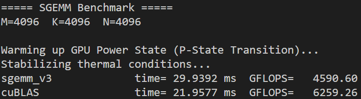  
现在的代码, 性能接近 cublas 的 $\tfrac{3}{4}$ 了
# VERSUION 4: Transpose  
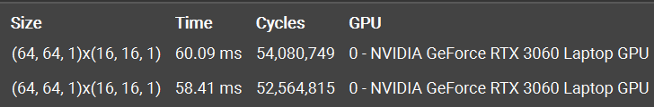  
采用先将 shared_a 转置之后, 代码并没有获得提升, 性能还有一点降低, 虽然现在在计算时可以直接使用两个 float4 load 指令就能做外积, 但是这个中转的过程又会增加指令. 而且可以发现, 即使多加了一个 register for trans load, 代码总共寄存器反而比上一版少了一个, 可能是因为这个 trans load register 的生命周期更加明确, 能够更好地复用寄存器.  
## Memory Workload Analysis  
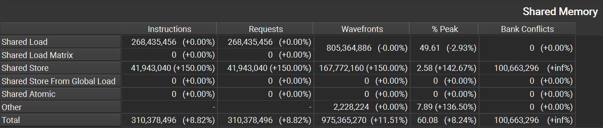  
可以假设上一版 shared_a, shared_b 均使用 float4 store 的时候各用 1 个指令, 现在 shared_a 改成标量 store 之后完成同样的事需要 4 个指令, $\tfrac{1+4}{1+1}=2.5$ 正好是原来的 2.5 倍, 增加了 150%. 还能发现该版本产生了之前没有的 store bank conflict, 对相关代码进行分析:  
```cpp
__shared__ float shared_a[K_PER_BLOCK][M_PER_BLOCK];  // transpose to {16, 64}
int s_row = tid / (K_PER_BLOCK / 4); 
int s_col = (tid % (K_PER_BLOCK / 4)) * 4;
shared_a[s_col + 0][s_row] = trans_load[0];
shared_a[s_col + 1][s_row] = trans_load[1];
shared_a[s_col + 2][s_row] = trans_load[2];
shared_a[s_col + 3][s_row] = trans_load[3];
```  
$bankID=(row\times64+col)\bmod32=col\bmod32$, 映射的位置只与 col 即代码中的 s_row 有关  
|tid|s_row=tid/4|bankID|
|:-:|:---------:|:----:|
|0  |0          |0     |
|1  |0          |0     |
|2  |0          |0     |
|3  |0          |0     |
|4  |1          |1     |
|5  |1          |1     |
|6  |1          |1     |
|7  |1          |1     |  

产生了 4 路 bank conflict, 拉长了时钟周期  
## Summary  
Shared Store Bank Conflicts: The memory access pattern for shared stores might not be optimal and causes on average a 4.0 - way bank conflict across all 41943040 shared store requests.This results in 100663296 bank conflicts, which represent 60.00% of the overall 167772160 wavefronts for shared stores.

ncu summary 的确提示代码在 shared store 时产生了 4 路冲突  

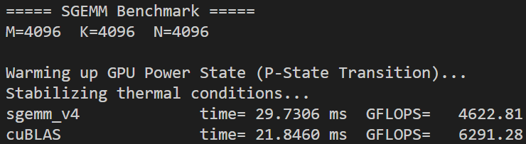  
由于该版本 transpose 优化有得有失，实际性能提升微乎其微  
# VERSION 5: Double Buffer  
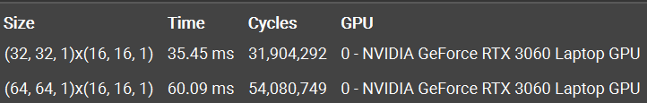  
在上一版中，单线程计算 16 次 FMA 需要 2 次 LDS.128，计算强度偏低，现在改成单线程计算 8*8 的外积，64 次 FMA 需要 4 次 LDS.128，计算强度提升为原来的 2 倍，也能够增强寄存器复用，这是 latency hiding 的一种方法，这一版代码中还通过 double buffer 的方法，使用 2 倍的 shared memory，在循环开始时就先发出 load 指令，然后在数据加载的过程中进行计算，算完之后再 `__syncthreads()`，进一步隐藏延迟，从而获得了 40.83% duration reduction 和 1.69× speedup
## Overview  
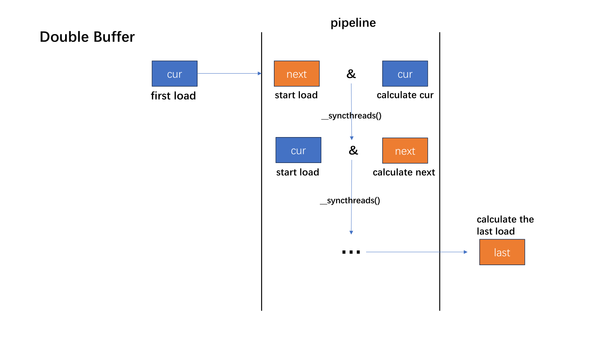  
## SOL  
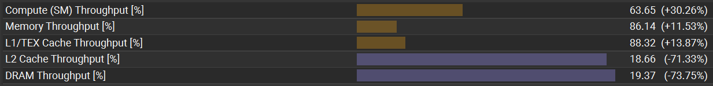  
从 ncu sol 可以看到经过优化后该版本的瓶颈已经上一版本的 memory bound 向 compute bound 转变，同时由于使用了更大的 shared memory，导致 L2 throughput 大幅下降，总体吞吐情况已经向 cublas 的形式靠近  
## Memory Workload Analysis  
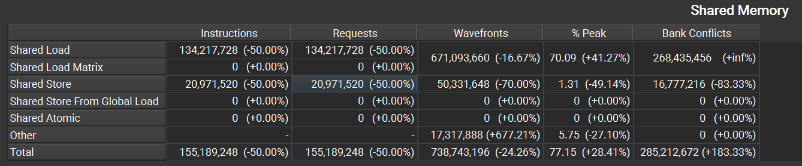  
出现了上一版代码没有的 shared load bank conflict，可以算出 v5 的 store bank conflict 由 v4 的 4 路冲突退化为 2 路冲突  
## Scheduler Statistics
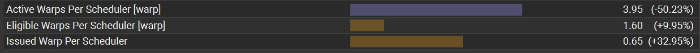  
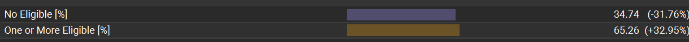  
平均每个调度器中活跃的 warps 减少了一半，但是每周期就绪和发射的 warps 实现了提升，现在调度器空转的时间减小到了 $\tfrac{1}{3}$，代码执行的效率更高了
## Occupancy  
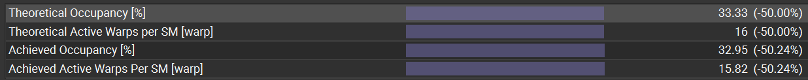  
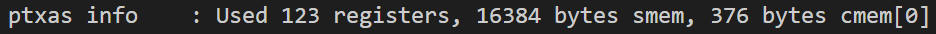  
由于这个版本使用了 123 registers/thread，导致 SM 上驻留的 block 由上一版的 4 个减少到了 2 个，同样也导致 active warps per scheduler 的减半，虽然此时 occupancy 只有 33% 了，但是代码性能实现了提升，这是值得的  
## Summary  
L1TEX Global Store Access Pattern: The memory access pattern for global stores to L1TEX might not be optimal. On average, only 16.0 of the 32 bytes transmitted per sector are utilized by each thread.  

ncu 显示全局写回的时候利用率只有 50%，可能是因为每个线程在同一次迭代中会有 2 次 STG.128，在第一次 STG.128 时，thread 0 关注的是 col{0, 1, 2, 3}，而 thread 1 关注的是 col{8, 9, 10, 11}，中间的 col{4, 5, 6, 7} 要等到 thread 0 的第二次 STG.128 才会被利用
# END  
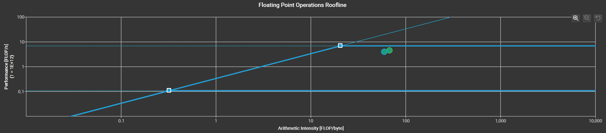
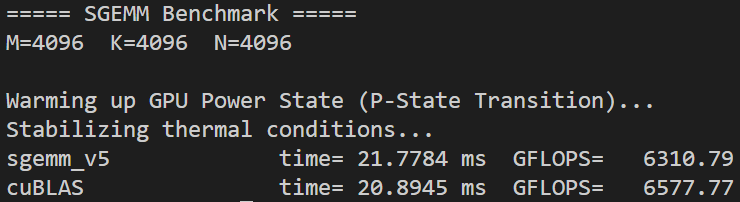  
最终的 SGEMM 实现达到了 6310.79 GFLOPS，在相同的基准测试配置下，相当于 cuBLAS FP32 极限性能的 95.9%，在 roofline 图中也有并驾齐驱的趋势

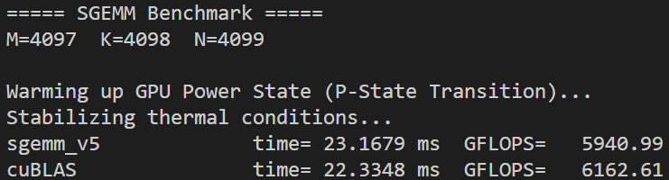  
在非对称不规则矩阵维度（$4097 \times 4098 \times 4099$）的附加基准测试中，该实现达到了 5941 GFLOPS 的算力吞吐，相当于 cuBLAS 相同配置下性能的 96.4%。这表明代码中的边界处理路径依然保持了高执行效率，并没有对整体吞吐量造成显著的负面影响。