# `constexpr int M{4096}, K{4096}, N{4096};`
# VERSION REFERENCE: CUBLAS  
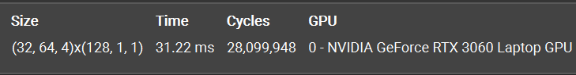  
## SOL
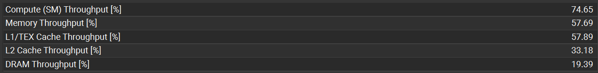  
# VERSION 0: Global Memory  
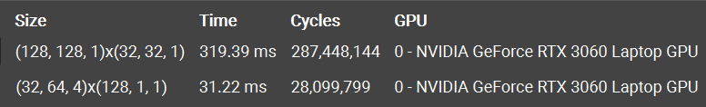  
仅用 Global Mem 的版本用时为 cublas 的 10 倍
## Overview  
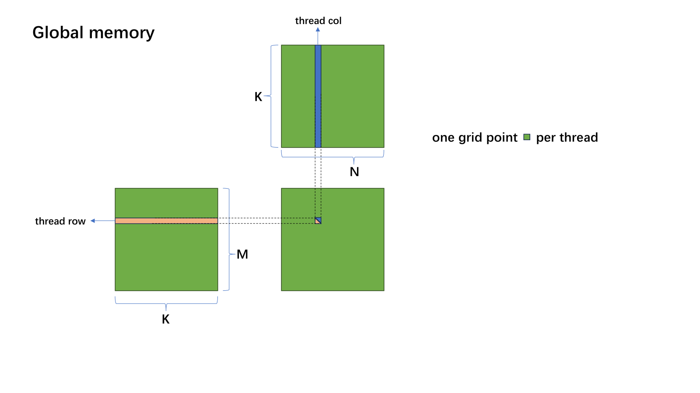  
## SOL  
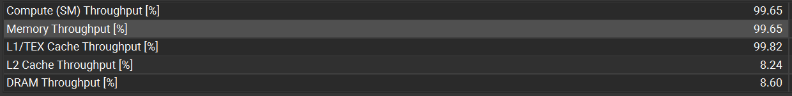  
查看 NCU Sol 的数据发现，SM Throughput， Memory Throughput 以及 L1 Cache 全部接近 100%，但 L2 Cache 和 DRAM Throughput 却仅有 8%，这可能是因为程序频繁的 global load 请求已经将 L1 堵满了，指令大多 stall 在 L1，向 L2 和 DRAM 发射请求的效率很低  
## Memory WorkLoad Analysis  
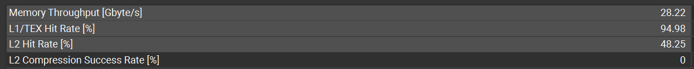  
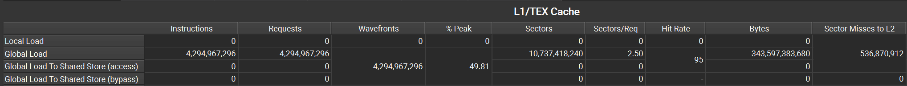  
在 `{4096, 4096, 4096}` 的测试规模下，由于每个线程只处理一个点，`value += A(row, k) * B(k, col)` 最终会有 $4096\times4096\times2\times4096\div32=4294967296$ 条指令，在同一个 warp 中，线程都访问的是 A 的同一个 float，触发广播，只需要一个 sector；对于 B，warp 会访问 32 个不同的 float，而一个 sector 32 字节，8 个 float，这样一条指令需要请求 4 个 sector，$(1+4)\div2=2.5(sector/request)$，与 NCU 显示数据相符合，此时程序的总 sector 就为 $4294967296\times2.5=10737418240$，sector misses to L2 一共有 536870912，$536870912\div10737418240=0.05$，刚好对应 memory analysis 显示的 L1 Hit Rate = 95%  
## Scheduler Statistics  
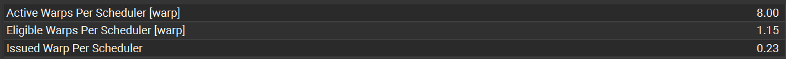  
  
平均每个调度器下挂载的活跃线程束达到了 8 个，但是 Eligible 的线程束却只有 1.15 个，能发射的更是只有 0.23 个，调度器 No Eligible 的时间占据 76%，这也对应了 SOL 中的状态，由于 global memory 的访存延迟太高了，导致绝大多数指令都只能 stall，程序处在一种“虚假繁荣”的状态  
## Summary
L1TEX Global Load Access Pattern：The memory access pattern for global loads from L1TEX might not be optimal. On average, only 26.4 of the 32 bytes transmitted per sector are utilized by each thread. This could possibly be caused by a stride between threads

NCU 显示 global load 并非最优，这是因为在 `A(row, k)` load 的时候，线程只需要一个 float 4字节，但是请求必须以 sector 32字节为单位，导致请求的数据没有完全利用。接下来考虑利用高速的片上共享内存来替代过多的全局内存访问，减小访存延迟，避免所有指令都通过 L1 Cache 向 global 请求数据。

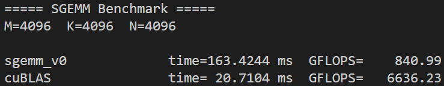  
naive SGEMM 性能只有 cublas 的 $\tfrac{1}{8}$，FLOPs 也仅达到 $\tfrac{1}{8}$
# VERSION 1: Shared Memory
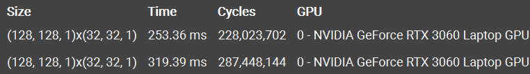  
使用 shared mem 后的 kernel 相比于 v0 有 20.7% latency reduction，1.26× speedup  
## Overview  
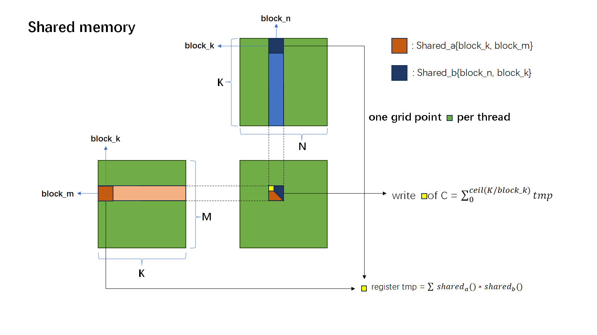  
## SOL  
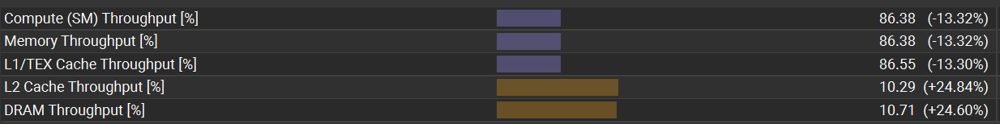  
使用 shared mem 后的代码，各项指标发生了比较一致的变化
## Memory Workload Analysis  
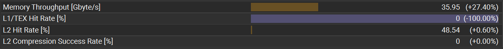  
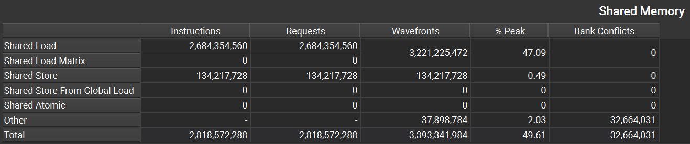  
L1 Hit Rate 归零，通过 shared mem 避免了高延迟的 global 访问，还能看到虽然 shared mem 没有 padding，但是也并没有发生 bank conflict，多出的 wavefront 可能是因为代码中设置的线程块太大以及访问共享内存时的分支判断造成的
## Scheduler Statistics  
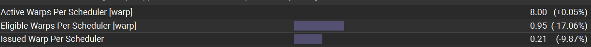  
  
在 shared mem 的程序中，Eligible warp 的数量下降了接近 $\tfrac{1}{5}$，调度器的效率进一步降低，有 79% 的时间都在空转，这是因为虽然用了高速的片上共享内存，但是也不得不使用 `__syncthreads()` 等待同步，增加了 stall 线程的数量  
## Summary
Mio Throttle Stalls: On average, each warp of this kernel spends 23.1 cycles being stalled waiting for the MIO (memory input/output) instruction queue to be not full. This stall reason is high in cases of extreme utilization of the MIO pipelines, which include special math instructions, dynamic branches, as well as shared memory instructions. When caused by shared memory accesses, trying to use fewer but wider loads can reduce pipeline pressure. This stall type represents about 61.1% of the total average of 37.9 cycles between issuing two instructions.

MIO 限流停顿：NCU 提示平均每个 warp 要花 23.1 个 cycle 等待 MIO 指令队列腾出空间，因为队列已经满了。在当前 $1\times1$ 的线程-数据映射下，每一次循环都要发出很多条 shared memory instructions，造成了 MIO pipeline 的拥堵  

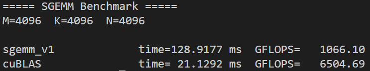  
即使用了 shared mem 避免了 global 的访存，代码性能仍然只有 cublas 的 $\tfrac{1}{6}$ 左右
# VERSION 2: $2\times2$ Blocking  
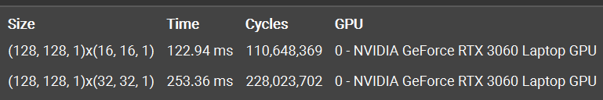  
使用一个线程负责 2*2 数据的搬运和计算，成功获得了 51.4% latency reduction 和 2.06× 的 speedup  
## SOL  
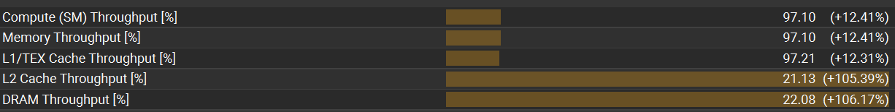  
改用单线程-多数据的映射后，各项 throughput 都获得了提升，其中由于指令数的减少，L2 以及 DRAM throughput 翻了一倍
## Memory Workload Analysis  
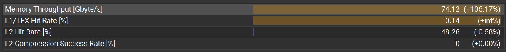  
  
得益于线程数的减少，整个程序的同步开销也大幅降低，从而以更高的效率搬运数据，也带来了吞吐量的翻倍 
## Scheduler Statistics  
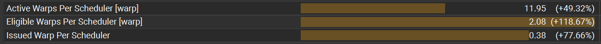  
  
这下调度器效率有了很大的提升，平均每个调度器中就绪的线程束数量增加了 118%，活跃的线程束也多了 49%，调度器在 37% 的时间里都是有就绪线程束的，相比上个版本增加了 77%，但是也能看到，虽然 eligible warps per scheduler 达到了 2.08，但是每个调度器能够发射的线程束却只有 0.38 个，在 memory analysis 中能够发现此时 max bandwidth 和 mem pipelines busy 都已经接近 100% 了，导致大部分时间 eligible 的 warp 都不能发射出去
## Occupancy
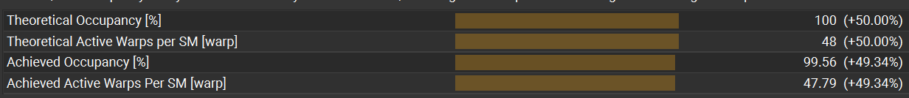  
由于上一个版本使用了 $32\times32=1024$ 线程的超大 block，导致硬件占有率偏低，缩减线程数之后，程序达到了 100% 的占有率，active warps per SM 也几乎是设备的最大值 48 个
## Summary
在代码中，虽然使用 2*2 block 减少了线程数量，但是一个线程要做四次 FMA，仍然需要 4 条 load 指令，此时片上访存指令与计算指令的比值是 1 : 1，这也是 mem pipeline busy 达到 97% 的原因，接下来可以考虑使用特殊的 `float4`，通过一条指令就能加载 4 个数，减小管线的繁忙程度

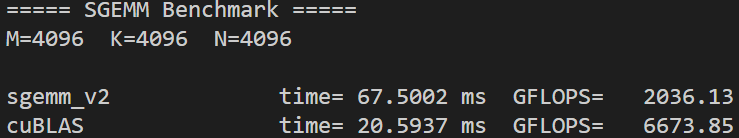  
现在的代码，性能已经接近 cublas 的 $\tfrac{1}{3}$ 了
# VERSION 3: Register Tiling  

## Overview  
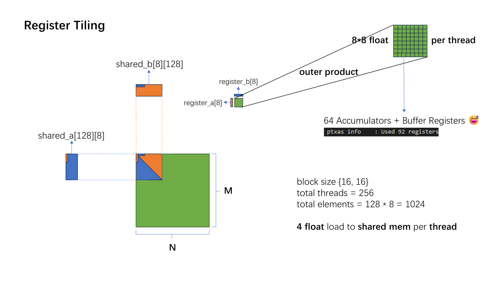  