# `constexpr int M = 4096, N = 1024;`
# version 0: Shared Memory  
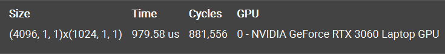  
## Overview  
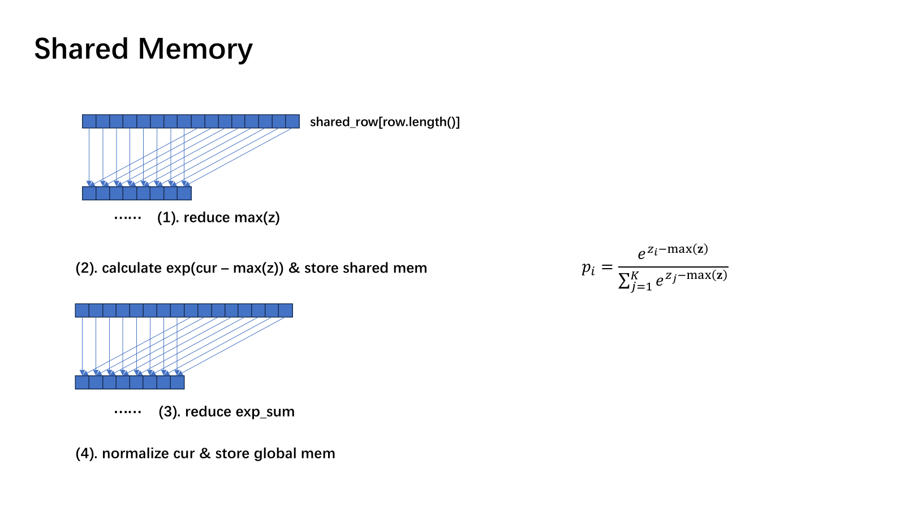  
## SOL
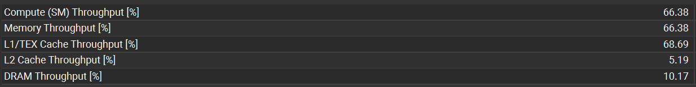  
第一版朴素的代码既不算 compute bound， 也不算 memory bound，由于是直接把整行搬到共享内存，所以 DRAM through 较低。  
## Scheduler Statistics  
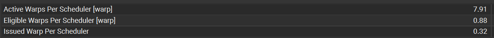  
  
调度器有超过 $\tfrac{2}{3}$ 的时间都在空转，可以看到活跃的 warps 很多，但是能够就绪和发射的很少。
## Warp Statistics  
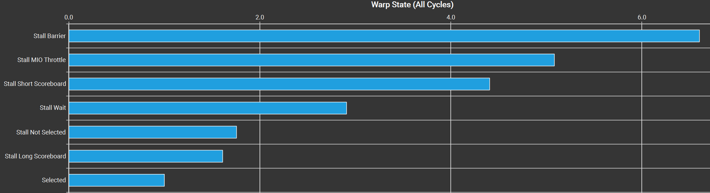  
stall 占比最高的就是 stall barrier，主要就是因为循环中有大量的 `__syncthreads()`，还有 shared mem 的频繁读写导致 MIO throttle 和 short scoreboard 也很高。
## Occupancy 
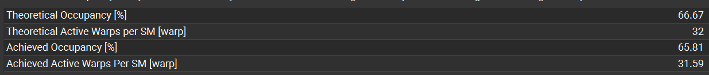  
由于该版本采用了 1024 threads 的 block，导致在当前设备上一个 SM 只能放下 $\left\lfloor \frac{1024}{1536} \right\rfloor=1$ 个 block，占有率为 $\tfrac{2}{3}$。
## Summary  
ncu 提示硬件占有率并非最优，存在线程发散，这个是因为在 reduce 后期时一个 warp 中活跃的线程越来越少，导致了这种现象。
# VERSION 1: Shuffle  
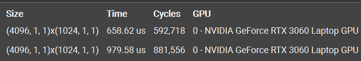  
Duration Reduction ≈ 32.8%，Speedup ≈ 1.49×  
这一版通过对最后一个 warp 进行寄存器洗牌，减少了访存 shared mem 时的同步屏障，也减少了上一版的线程发散。
## Memory Workload Analysis  
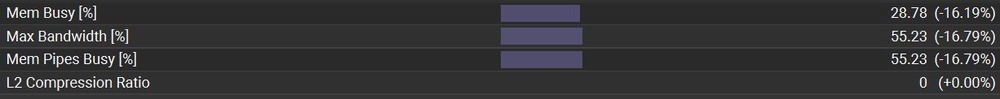  
减少了对共享内存的访存，现在整体内存和管线压力也小了一些。  
## Warp Statistics
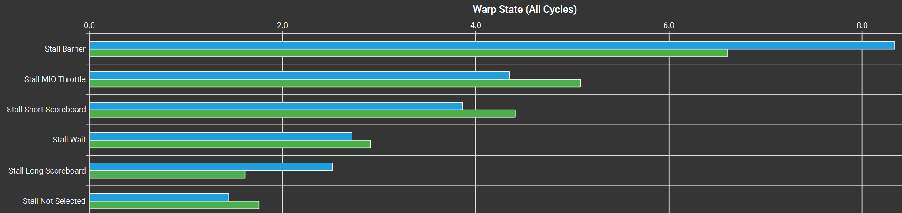  
按理说减少了总的 `__syncthreads()`，stall barrier 应该减少，但是 ncu 却显示增加，因为 ncu warp stall 统计的是某个时钟周期 warp stall 的原因而不是代码 stall 的总时间，在这一版中大多数 stall 指标相对于上一版都减小了，shuffle 计算也更快，导致 stall 的主力 barrier stall 被放大了。
# VERSION 2: Float4 Vectorized  
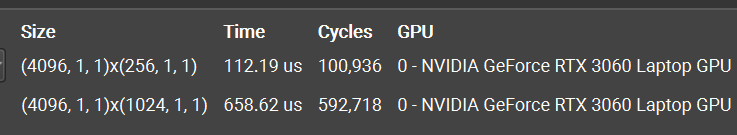  
Duration Reduction ≈ 83.0%，Speedup ≈ 5.88× 
使用一个线程算 4 个数据，现在一个 block 只有 256 个线程，理论硬件占有率能达到 100% 了。
## SOL  
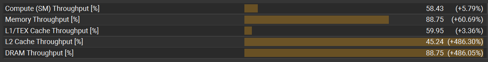  
内存吞吐量获得了很大的提升，可能是因为向量化的合并访存，指令数的减少以及 occupancy 的提升。
## Scheduler Statistics  
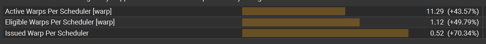  
  
调度器的效率更高了，有 52% 的时间都有就绪的 warp。
## Warp Statistics  
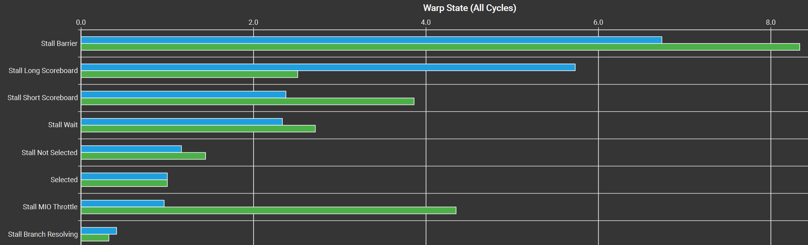  
这一版的 MIO throttle 降低很多，因为使用了更少指令的向量化加载，也因为现在指令发射更顺畅了，所以 stall long scoreboard 增加，指令访存所需的延迟暴露了出来。
# VERSION 3: Warp-level Block Reduction  
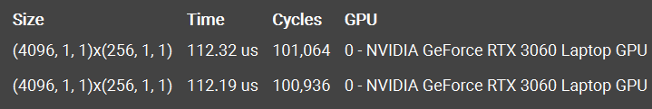  
性能与上一版持平，在这一版中，使用 `warpReduce()` 函数直接对一个线程束进行归约，减少了大量之前循环中的 `__syncthreads()`，通过设置 `4 float per thread`，一行只需要 256 threads 即 8 个 warp，最后只需要把这 8 个 wapr 各自的结果存在 `shared mem[8]` 当中，在这里同步一次后再调用 `warpReduce()` 就能得到 row_max，后面的 sum 同理。
## SOL  
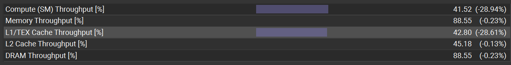  
可以看到 shuffle 替代了大量的共享内存操作后，指令数更少了导致 SM throughput 减小，并且 L1 cache throughput 也因为更少的共享内存访存而减小。  
## Memory Workload Analysis
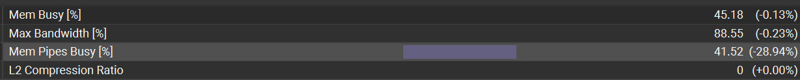  
内存管线繁忙减小了，这是因为 shuffle 通过直接操作寄存器去掉了大量的共享内存指令。
## Scheduler Statistics  
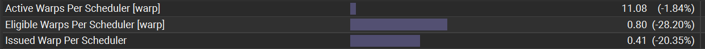  
  
调度器 no eligible 增加 22%
## Warp Statistics  
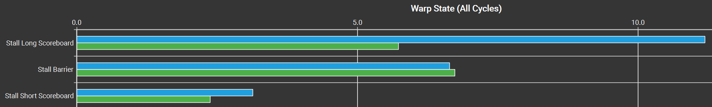  
这一版的 stall reason 由之前的 barrier 变成了 long scoreboard，因为现在 shuffle 指令执行起来更快，从而将 long scoreboard 暴露出来了，也导致了每个周期就绪线程束减少，调度器空转增加。  
# VERSION 4: Warp per Row  
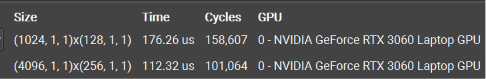
一行只有 1024 个数据，但是上一版代码中却用了 8 个 warps，在这一版中直接使用 1 个 warp 来处理一整行数据。
## Overview  
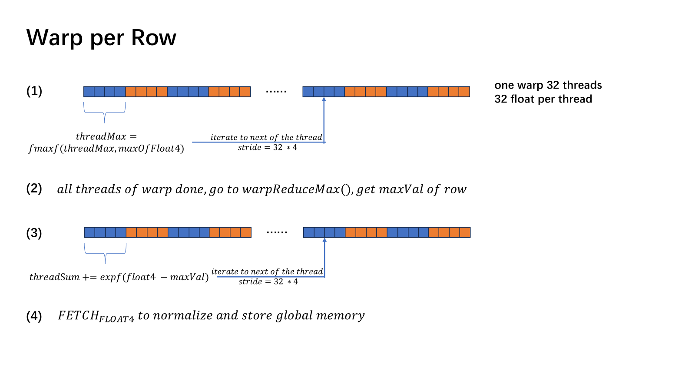  
## SOL  
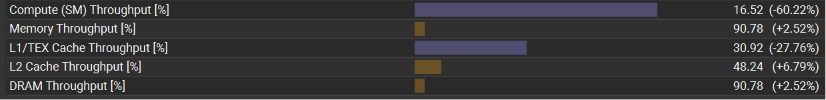  
这一版代码的性能降低了，并且在 DRAM throughput 没变的情况下，compute throughput 降低了 60%。
## Memory Workload Analysis  
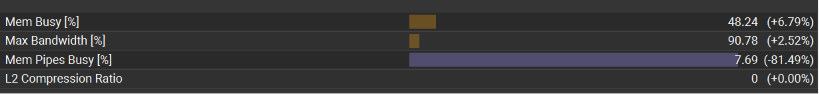  
mem pipeline busy 降低了 81%，在这一版代码中完全去掉了共享内存的访存，使用 shuffle 直接对寄存器洗牌，也减少了 SM 执行的指令数量。  
## Warp Statistics  
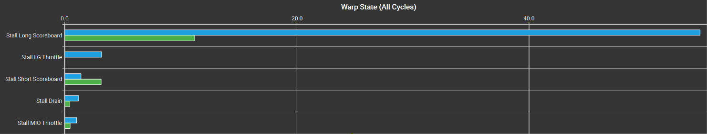  
查看调度器发现 no eligible 百分比相较上一版本增加了 42%，达到了 83%，在 warp statistics 中看到 stall long scoreboard 大幅增加，因为移除了速度更快的 shared mem 后，从 global mem 拿取数据的延迟更加明显了。  
# VERSION 5: Online Softmax  
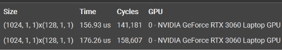  
## Overview  
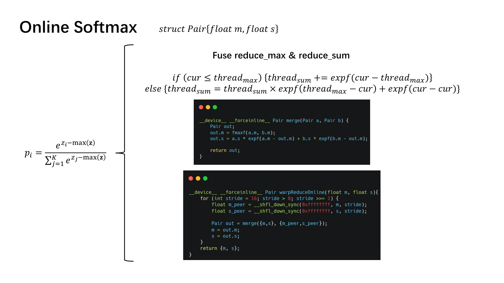  
## SOL  
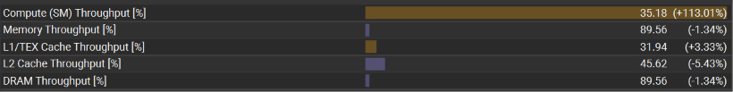  
将 reduce_max 和 reduce_sum 融合，减少了 global load 的次数和等待，SM 计算管线利用更加充分了。
## Compute Workload Analysis  
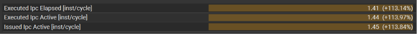  
  
通过 kernel fusion，每周期活跃，发射指令等相关指标都获得了 113% 的提升，表明融合主要通过减少 stall 而非增加吞吐来提升性能。  
## Scheduler Analysis  
  
  
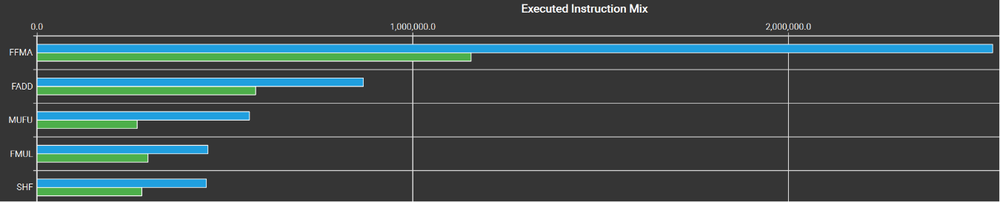  
可以发现调度器的效率相对上一版的确提升很多，并且将原本分两次串行的计算合并之后减少了全局内存的访问，stall long scoreboard 大大减少，各种数学计算相关指令也显著增加。
# END  
| Version | Optimization | Time (ms) ↓ | Bandwidth (GB/s) ↑ | Relative Speedup |
|----------|----------|----------:|----------:|----------:|
| V0 | Shared Memory Reduction | 0.4911 | 68.33 | 1.00× |
| V1 | Warp Shuffle | 0.3174 | 105.72 | 1.55× |
| V2 | Float4 Vectorization | 0.1099 | 305.24 | 4.47× |
| V3 | Warp-level Block Reduction | 0.1099 | 305.39 | 4.47× |
| V4 | Warp per Row | 0.1724 | 194.62 | 2.85× |
| V5 | Online Softmax | 0.1531 | 219.16 | 3.21× |

| Version | Main Optimization       | Dominant Stall  |
| ------- | ----------------------- | --------------- |
| V0      | Shared Memory Reduction | Barrier         |
| V1      | Warp Shuffle            | Barrier         |
| V2      | Float4 Vectorization    | Long Scoreboard |
| V3      | Warp-level Reduction    | Long Scoreboard |
| V4      | Warp-per-Row            | Long Scoreboard |
| V5      | Online Softmax          | Math / Compute  |

从最终的 Benchmark 结果来看，性能最好的实现上是 Version 2 和 Version 3，而引入 Warp-per-Row 和 Online Softmax 后，运行时间反而有所增加。  

这并不意味着后续优化方向是错误的。前面的优化主要集中在 CUDA 编程模型和硬件特性的利用上，例如向量化访存、Warp Shuffle、减少同步屏障以及降低共享内存开销等，其目标是尽可能提高单个 Softmax Kernel 的执行效率。

而从 Version 4 开始，关注点逐渐从“如何让当前 Kernel 更快”转向“如何让算法更适合后续融合（Fusion）”。

传统 Softmax 需要分别计算 `max`、`sum(exp(x-max))` 和最终归一化，往往需要多次遍历输入数据。当序列长度进一步增大时，多轮 Global Memory 访问带来的代价会越来越明显。Online Softmax 通过维护 `(max, sum)` 状态，将多个归约过程融合到一次扫描中，虽然引入了更复杂的计算逻辑，但减少了数据重复读取，为后续 Kernel Fusion 提供了基础。

现代高性能 Attention 实现采用的正是类似的思想：相比单独优化 Softmax Kernel 的吞吐率，更重要的是减少中间结果落入 Global Memory，并将矩阵乘法、Softmax 和后续计算融合到同一个计算流水线中。此时 Online Softmax 的价值不再体现在单独的 Softmax Benchmark 上，而体现在整个 Attention 算子的端到端性能提升上。